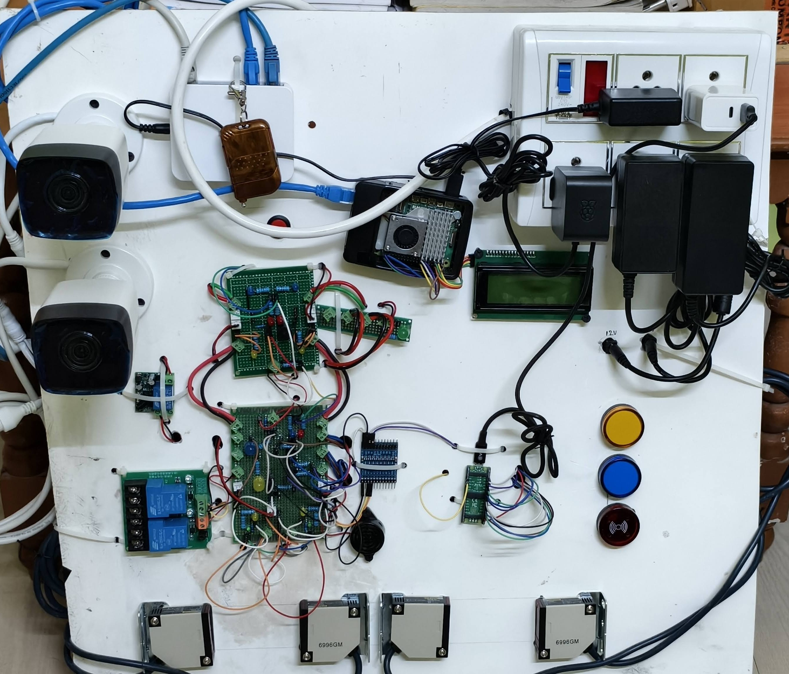

# Car Parking Automation System using YOLOv5 & Raspberry Pi

This is a **fully deployed, real-time automated car parking system** using Raspberry Pi and YOLOv5 for vehicle detection.  
The system actively manages vehicle entry and exit, controls boom barriers, and updates an LCD display with live stats for multiple vehicle types.  
Deployed at **Mauli Water Park**, ensuring efficient and smooth vehicle management in a live environment.

---

## **Project Overview**

This project integrates **computer vision, IoT, and embedded systems** to create a fully functional parking management solution. It can detect multiple types of vehicles in real-time, display information on an LCD, trigger a boom barrier, and even handle system shutdown safely using a physical button.

## Key Features

- **Real-time vehicle detection** with YOLOv5 (ONNX model)
- **Automated boom barrier** control using GPIO and LEDs
- **LCD display** showing live vehicle counts and types
- **Multi-threaded design** for reliability and continuous operation
- **Self-recovery** in case of errors or camera disconnects

---

## **Hardware Used**

| Component                    | Purpose                             |
| ---------------------------- | ----------------------------------- |
| Raspberry Pi 5 (4GB)         | Main controller                     |
| RTSP IP Cameras (Hikvision) | Video capture for vehicle detection |
| LEDs (GPIO 22 & 27)          | Heartbeat and indicator LEDs        |
| Boom Barrier Relay (GPIO 26) | Control entrance barrier            |
| I2C LCD (PCF8574, 20x4)      | Display vehicle counts & messages   |
| Shutdown Button (GPIO 21)    | Safe manual system shutdown         |

---

## **Software & Libraries**

* **Python 3.11**
* **OpenCV** (for video handling)
* **Ultralytics YOLOv5** (pre-trained model)
* **gpiozero** (GPIO pin control)
* **RPLCD** (LCD display)
* **threading** (multi-threaded camera & LCD handling)
* **subprocess** (for safe shutdown and reboot commands)

---

## **System Architecture**

1. **Vehicle Detection Thread:**

   * Captures frames from RTSP cameras.
   * Runs YOLOv5 detection (`yolov5n.pt` / `yash.onnx`).
   * Updates detection counts and confidence levels.

2. **LCD Display Thread:**

   * Continuously updates the 20x4 LCD with real-time vehicle data.
   * Alternates camera display if multiple cameras are active.
   * Shows “Ready” message when no vehicles are detected.

3. **Boom Barrier Control Thread:**

   * Reads the `detect_flag.txt` updated by YOLO threads.
   * Opens barrier on vehicle presence, blinks LED for visual feedback.
   * Closes barrier safely once vehicle leaves.

4. **Shutdown Button Thread:**

   * Monitors GPIO 21 for button press.
   * Displays shutdown message on LCD.
   * Executes safe Raspberry Pi shutdown.

---

## **Installation & Setup**

1. **Clone the Repository**

```bash
git clone https://github.com/yash-masne/car-parking-system.git
cd car-parking-system
```

2. **Install Dependencies**

```bash
pip install opencv-python gpiozero RPLCD ultralytics
```

3. **Connect Hardware**

* Connect cameras to Raspberry Pi or network.
* Connect LEDs and boom barrier relay to GPIO pins (as per code).
* Connect the I2C LCD.
* Connect the shutdown button to GPIO 21.

4. **Run the System**

```bash
python3 main_system.py
python3 boom_barrier.py
python3 shutdown_button.py
```

> **Tip:** Run all scripts in the background or as services for a fully autonomous system.

---

## **How it Works**

1. **Startup:**

   * System displays a 20-second countdown on LCD (“Starting in XXs”).
   * YOLO model is loaded (`yolov5n.pt` or `yash.onnx`).
   * Heartbeat LED indicates healthy operation.

2. **Vehicle Detection:**

   * Cameras continuously capture video.
   * YOLO detects vehicles and updates a flag file (`detect_flag.txt`).
   * LCD shows vehicle type, count, and confidence.

3. **Barrier Automation:**

   * Barrier opens only when a vehicle is detected.
   * LED blinks while barrier is opening.
   * Barrier closes automatically once the vehicle leaves.

4. **Error Handling & Resilience:**

   * Detects camera disconnections and attempts reconnection.
   * LCD shows error messages in case of system failures.
   * Can reboot itself or alert for manual intervention if critical error occurs.

5. **Manual Shutdown:**

   * Press shutdown button to safely power off Raspberry Pi.
   * LCD displays shutdown instructions and waits for completion.

---

## **Vehicle Classes Detected**

| Class ID | Vehicle Type |
| -------- | ------------ |
| 2        | Car          |
| 3        | Bike         |
| 5        | Bus          |
| 7        | Truck        |
| 10       | Tractor      |

---

## **Future Improvements**

* Add **license plate recognition** for automatic logging.
* Integrate **cloud-based monitoring** for multiple parking sites.
* Use **YOLOv8** or **custom-trained model** for higher detection accuracy.
* Add **SMS or push notifications** when parking is full.

---

## **Screenshots / Demo**

**Hardware Setup**



**LCD Display Example:**

```
  Mauli Water Park
       Ready
Waiting for Vehicles
```

**Vehicle Detected Example:**

```
Camera 1: Detected
Car:2 98%
Bus:1 90%
Truck:0 0%
```

---

## **Why This Project Stands Out**

* Fully automated system integrating **CV, IoT, and embedded hardware**.
* Robust error handling and graceful shutdown.
* Multi-threaded design ensures **real-time performance**.
* Can be extended for **smart cities, malls, and gated communities**.

---

## **Contact**

**Yash Masne**

* Email: [yashmasne7@gmail.com](mailto:yashmasne7@gmail.com)
* GitHub: [https://github.com/yash-masne](https://github.com/yash-masne)

---


